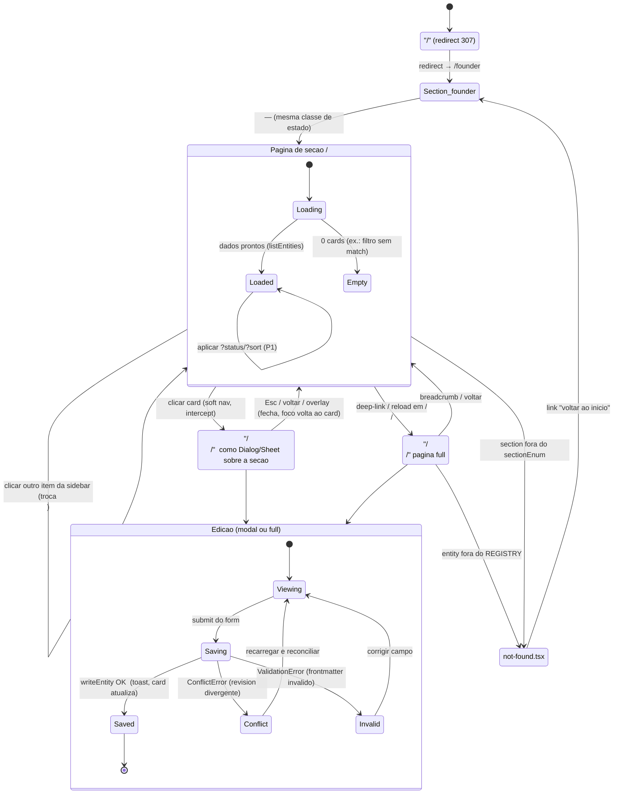

# BusinessOS — Information Architecture (Navegacao & Rotas)

> **Documento derivado.** Traduz a estrutura fixada no PRD (`docs/01-prd.md`, requisitos
> `R-NAV-*`), no Modelo de Conteudo (`docs/02-content-model.md`, `REGISTRY` e contrato
> `readEntity`/`listEntities`) e no Design System (`docs/03-design-system.md`, sidebar,
> cards e view-toggle) em uma **arquitetura de informacao e mapa de rotas** pronto para
> implementar com **Next.js App Router**. Em conflito de escopo/visao, o briefing
> prevalece; sobre a forma dos arquivos, o Modelo de Conteudo prevalece; sobre tokens
> visuais, o Design System prevalece.

---

## 1. Objetivo e escopo

Fixar, de forma pronta para implementacao:

1. A **arvore de sidebar/navegacao** (4 secoes, ordem fixa).
2. O **mapa de rotas** completo: `/`, `/<section>`, `/<section>/<entity>`, mais estados de erro.
3. A relacao **label PT-BR (exibicao) x slug (URL/arquivo)** — a **tabela exata** de secoes e entidades.
4. O **breadcrumb** e a regra de rotulos.
5. O **esquema de URL** para a visualizacao grid/lista (e params reservados de filtro/ordenacao).
6. A **anatomia de pagina** por secao e por entidade.
7. Um **diagrama de estados de navegacao** (maquina de estados) e as transicoes.

Fora de escopo: schema de frontmatter (ver `docs/02`), tokens/componentes visuais (ver
`docs/03`), arquitetura de gravacao em disco / Server Actions (doc de arquitetura),
fluxo interno de agentes (doc de agentes). Aqui tratamos **estrutura navegavel + URLs**.

**Principio-guia (herdado do briefing):** a IA e um espelho 1:1 do modelo de conteudo —
**1 secao = 1 item de sidebar = 1 rota `/<section>`**; **1 entidade = 1 card = 1 rota
`/<section>/<entity>` = 1 arquivo `content/<section>/<entity>.md`**. Nada de niveis
intermediarios, abas ocultas ou telas orfas.

---

## 2. Convencoes: slug, label e idioma

Reafirmando a decisao canonica do Modelo de Conteudo (secao 2 de `docs/02`):

- **Slug = identificador tecnico, em ingles-quando-tecnico / kebab-case pt-BR-quando-nome-de-negocio.**
  E o que aparece na **URL** e no **nome do arquivo**. Ex.: `direcao`, `tese-de-valor`,
  `perfil-ideal-de-cliente`. Regex: `^[a-z0-9-]+$`. **Slugs nunca mudam** (sao chave estavel).
- **Label = texto de exibicao (pt-BR).** Aparece na **sidebar**, no **H1 da pagina**, no
  **breadcrumb** e no **`<title>`**. Vem de dicionarios em codigo (`SECTION_LABEL`,
  e o campo `title` de cada entidade no `REGISTRY`).
- A UI **nunca** deriva label a partir do slug por string-transform; sempre consulta o
  dicionario. Isso evita "mapa-do-mercado" virar "Mapa Do Mercado" torto.
- **Sem acento nos labels canonicos** (`Direcao`, `Validacao`), para casar com o
  `SECTION_LABEL` do `docs/02` e com a convencao textual do repositorio. Uma camada
  cosmetica de acentuacao (`Direção`, `Validação`) pode ser aplicada depois **sem tocar
  em slugs nem rotas** — e puramente de apresentacao.

> Regra de ouro: **URL e arquivo compartilham o mesmo par `<section>/<entity>`**. A rota
> `/direcao/tese-de-valor` mapeia direto para `content/direcao/tese-de-valor.md` e para o
> `id: direcao/tese-de-valor`. Um so vocabulario para navegacao, disco e agentes.

---

## 3. Tabela exata de labels PT-BR x slugs

### 3.1 Secoes (itens de sidebar / rotas de topo)

Ordem **fixa** (espelha a construcao do negocio: quem constroi -> para onde -> o que foi
testado -> como entra dinheiro). E a mesma ordem do `sectionEnum` e do `SECTION_LABEL`.

| # | Slug (`section`) | Label PT-BR (sidebar / H1) | Rota | Icone sugerido (lucide) | Overline de grupo |
|---|---|---|---|---|---|
| 1 | `founder`   | Founder    | `/founder`   | `User`     | SECOES |
| 2 | `direcao`   | Direcao    | `/direcao`   | `Compass`  | SECOES |
| 3 | `validacao` | Validacao  | `/validacao` | `CheckCircle` | SECOES |
| 4 | `caixa`     | Caixa      | `/caixa`     | `Wallet`   | SECOES |

Dicionario em codigo (fonte de verdade dos labels de secao):

```ts
// lib/nav/labels.ts
export const SECTION_ORDER = ['founder', 'direcao', 'validacao', 'caixa'] as const;

export const SECTION_LABEL: Record<Section, string> = {
  founder: 'Founder',
  direcao: 'Direcao',
  validacao: 'Validacao',
  caixa: 'Caixa',
};

// Subtitulo curto por secao (usado no header da pagina e como description do <title>)
export const SECTION_TAGLINE: Record<Section, string> = {
  founder: 'Quem esta construindo e por que',
  direcao: 'Para onde o negocio aponta',
  validacao: 'O que ja foi testado com a realidade',
  caixa: 'Como o dinheiro entra e se move',
};
```

### 3.2 Entidades (cards / rotas de detalhe)

Uma linha por entidade das 11. `title` e `order` vem do `REGISTRY` (`docs/02`, secao 8.1);
`order` define a posicao do card na pagina da secao (asc). **`oferta` aparece duas vezes**
— sao **arquivos e rotas distintos** por secao (`/direcao/oferta` != `/validacao/oferta`).

| Secao | Slug (`entity`) | Label PT-BR (`title`) | `id` | `order` | Rota de detalhe |
|---|---|---|---|---|---|
| `founder`   | `objetivo`               | Objetivo                | `founder/objetivo`               | 1 | `/founder/objetivo` |
| `founder`   | `estilo-de-vida`         | Estilo de vida          | `founder/estilo-de-vida`         | 2 | `/founder/estilo-de-vida` |
| `direcao`   | `mapa-do-mercado`        | Mapa do mercado         | `direcao/mapa-do-mercado`        | 1 | `/direcao/mapa-do-mercado` |
| `direcao`   | `ima-de-problemas`       | Ima de problemas        | `direcao/ima-de-problemas`       | 2 | `/direcao/ima-de-problemas` |
| `direcao`   | `perfil-ideal-de-cliente`| Perfil ideal de cliente | `direcao/perfil-ideal-de-cliente`| 3 | `/direcao/perfil-ideal-de-cliente` |
| `direcao`   | `tese-de-valor`          | Tese de valor           | `direcao/tese-de-valor`          | 4 | `/direcao/tese-de-valor` |
| `direcao`   | `oferta`                 | Oferta (tese)           | `direcao/oferta`                 | 5 | `/direcao/oferta` |
| `validacao` | `oferta`                 | Oferta (validada)       | `validacao/oferta`               | 1 | `/validacao/oferta` |
| `validacao` | `primeiros-clientes`     | Primeiros clientes      | `validacao/primeiros-clientes`   | 2 | `/validacao/primeiros-clientes` |
| `caixa`     | `fluxo-de-caixa`         | Fluxo de caixa          | `caixa/fluxo-de-caixa`           | 1 | `/caixa/fluxo-de-caixa` |
| `caixa`     | `erp`                    | ERP                     | `caixa/erp`                      | 2 | `/caixa/erp` |

> A UI **nao inventa** essa lista a partir do filesystem: ela deriva do `REGISTRY`
> (`docs/02`, secao 8.1), garantindo que toda entidade canonica tenha card+rota mesmo com
> `status: empty`, e que nenhum arquivo orfao vire rota. Um arquivo em `content/` fora do
> `REGISTRY` e ignorado (com aviso), nunca ganha rota.

### 3.3 Mapa enum -> label de `status` (usado em badges e filtros de URL)

Herdado de `docs/02` secao 6.2 (autoridade). A IA usa esses labels no badge do card, no
header do detalhe e como rotulo do filtro `?status=` (secao 6.3).

| Valor (`status`, slug de filtro) | Label PT-BR (UI) |
|---|---|
| `empty`        | Vazio |
| `draft`        | Rascunho |
| `in_progress`  | Em progresso |
| `needs_review` | Aguardando revisao |
| `validated`    | Validado |
| `archived`     | Arquivado |

---

## 4. Arvore de sidebar / navegacao

A sidebar (spec visual em `docs/03`, secao 7.1) e a **navegacao primaria e persistente**.
Nao ha navegacao secundaria por abas dentro das secoes — a profundidade e sempre
sidebar -> pagina de secao -> detalhe da entidade.

```
BusinessOS  (marca, topo — link para /founder)
│
├─ SECOES                      (overline, nao-interativo)
│   ├─ Founder      → /founder
│   ├─ Direcao      → /direcao
│   ├─ Validacao    → /validacao
│   └─ Caixa        → /caixa
│
└─ Footer (meta: versao / status do app; nao-navegacional)
```

Regras de comportamento da sidebar:

- **Sempre 4 itens, sempre nessa ordem** (`R-NAV-01`). A lista e renderizada de
  `SECTION_ORDER`, nunca hardcoded no JSX.
- **Item ativo** = derivado do **primeiro segmento** da rota atual (`section`). Em
  `/direcao` **e** em `/direcao/tese-de-valor`, o item "Direcao" fica ativo (o detalhe de
  entidade nao "sai" da secao). Ver secao 5.4.
- **Hover** e **ativo** usam `bg-accent`; o ativo se distingue por `font-semibold` + rail
  de 2px + `aria-current="page"` (P&B, sem cor — `docs/03` 7.1).
- **As entidades NAO aparecem na sidebar.** Elas sao cards dentro da pagina da secao. A
  sidebar lista somente secoes — manter a navegacao rasa e calma e um objetivo de design.
- **Responsivo:** abaixo de `md`, a sidebar vira `Sheet` (drawer) acionado por hamburguer
  no header; a arvore e os estados sao identicos.

---

## 5. Mapa de rotas (Next.js App Router)

### 5.1 Arvore de arquivos de rota

Abordagem **dinamica dirigida pelo `REGISTRY`**: um segmento `[section]` e um `[entity]`,
com `generateStaticParams` a partir do `REGISTRY` e `notFound()` para qualquer par fora
dele. Mantem consistencia com "o registro e a fonte de verdade" e evita 8+ pastas
repetidas.

```
app/
├─ layout.tsx                      # shell raiz: <html lang="pt-BR">, Inter, <Sidebar/> + <main>
├─ page.tsx                        # "/"  → redirect('/founder')   (R-NAV-05)
├─ not-found.tsx                   # 404 global (rota inexistente / fora do REGISTRY)
├─ loading.tsx                     # skeleton de fallback do shell (opcional)
│
├─ [section]/
│  ├─ page.tsx                     # "/<section>"  → pagina de cards da secao
│  ├─ loading.tsx                  # skeleton de grid/lista (docs/03, 9.2)
│  ├─ not-found.tsx                # section fora do sectionEnum
│  │
│  ├─ @modal/                      # slot paralelo p/ modal de edicao (default.tsx = null)
│  │  └─ (.)[entity]/
│  │     └─ page.tsx               # intercepta "/<section>/<entity>" → abre <EditDialog/>
│  │
│  └─ [entity]/
│     ├─ page.tsx                  # "/<section>/<entity>"  → pagina de detalhe/edicao (full)
│     └─ not-found.tsx             # entity fora do REGISTRY p/ aquela secao
```

`generateStaticParams` (esboco):

```ts
// app/[section]/[entity]/page.tsx
export function generateStaticParams() {
  return REGISTRY.map((e) => ({ section: e.section, entity: e.entity }));
}
// Em runtime: se `${section}/${entity}` nao esta no REGISTRY -> notFound().
```

### 5.2 Tabela mestre de rotas

| Rota | Segmento(s) | Renderiza | Loader de dados (docs/02, secao 10) | Ativo na sidebar |
|---|---|---|---|---|
| `/` | — | Redirect 307 → `/founder` | — | — |
| `/founder` | `[section]=founder` | `SectionPage` (cards) | `listEntities('founder')` | Founder |
| `/direcao` | `[section]=direcao` | `SectionPage` (cards) | `listEntities('direcao')` | Direcao |
| `/validacao` | `[section]=validacao` | `SectionPage` (cards) | `listEntities('validacao')` | Validacao |
| `/caixa` | `[section]=caixa` | `SectionPage` (cards) | `listEntities('caixa')` | Caixa |
| `/<section>/<entity>` | `[section]`,`[entity]` | `EntityPage` (form) — modal via intercept, full via deep-link | `readEntity('<section>/<entity>')` | secao pai |
| `/*` (invalido) | — | `not-found.tsx` | — | nenhum |

Nao ha outras rotas no MVP. Sem `/settings`, sem `/search`, sem `/agents` — se surgirem,
entram como novos itens de sidebar num doc posterior, nunca aninhados dentro das 4 secoes.

### 5.3 Padrao de edicao: rota de entidade addressavel + modal (intercepting routes)

Concilia duas exigencias que parecem em tensao:

- **PRD `R-NAV-04`:** existe **rota por entidade** para edicao, deep-linkavel
  (`/direcao/tese-de-valor`).
- **Design `docs/03` 9.3:** a edicao acontece em **`Dialog` (desktop) / `Sheet` (mobile)**.

Solucao canonica (padrao nativo do App Router):

1. **Soft navigation** (clique no card dentro de `/direcao`): o slot `@modal` **intercepta**
   `(.)[entity]` e abre o `EditDialog` **por cima** da grade de cards. A URL muda para
   `/direcao/tese-de-valor`, o historico ganha uma entrada, mas a pagina de secao
   permanece montada atras (contexto preservado).
2. **Botao voltar / `Esc` / clique no overlay:** fecha o modal e retorna a `/direcao`
   (a entrada de historico do modal e removida). Foco retorna ao card de origem.
3. **Hard navigation** (colar a URL, recarregar, link externo, aba nova): nao ha intercept;
   renderiza a **pagina de detalhe full** `[entity]/page.tsx` — mesmo formulario, layout de
   pagina inteira com breadcrumb. Deep-link sempre funciona.

Assim, **uma unica URL** (`/<section>/<entity>`) serve tanto o modal quanto a pagina full,
e o compartilhamento/refresh nunca "perde" o estado de edicao. `EntityForm` e o mesmo
componente nos dois casos; muda apenas o container (`Dialog`/`Sheet` vs `<main>`).

> **Fallback simples (se intercepting routes for adiado):** `/<section>/<entity>` renderiza
> sempre a pagina full; o clique no card e um `<Link>` normal. Perde-se a sensacao de modal,
> mas a IA/rotas ficam identicas. A adocao do `@modal` e uma melhoria de UX, nao muda o
> contrato de URLs.

### 5.4 Deteccao de secao/entidade ativa

```ts
// A partir de usePathname(): "/direcao/tese-de-valor"
const [, section, entity] = pathname.split('/'); // section='direcao', entity='tese-de-valor'
const activeSection = section as Section | undefined;   // destaca item da sidebar
const activeEntity  = entity ?? null;                   // destaca card / abre modal
```

- Sidebar: item ativo = `activeSection` (independe de haver `entity`).
- Card: em modo modal, o card correspondente a `activeEntity` pode receber `data-active`.

---

## 6. Esquema de URL para visualizacao grid/lista

### 6.1 Parametro canonico

A preferencia de visualizacao (`grid` | `list`, `docs/03` 7.3) e refletida como **query
param na rota da secao**, tornando a escolha **compartilhavel e deep-linkavel**:

```
/<section>?view=grid        # grade responsiva (default)
/<section>?view=list        # lista densa, largura total
```

| Param | Valores validos | Default | Onde vale |
|---|---|---|---|
| `view` | `grid` \| `list` | `grid` | apenas rotas de secao `/<section>` |

- Nome do param: **`view`**. Valores exatos: **`grid`** e **`list`** (casam com os values do
  `Select` de `docs/03` 7.3 e com o `localStorage["businessos.view"]`).
- Valor ausente ou invalido → cai para a **cadeia de precedencia** (6.2), nunca quebra.
- O param **so existe nas rotas de secao**. Rotas de detalhe (`/<section>/<entity>`) nao o
  usam; se herdado por engano, e ignorado.

### 6.2 Precedencia e sincronizacao

Ordem de resolucao do valor efetivo ao renderizar `/<section>`:

```
1. ?view= na URL (se for 'grid' ou 'list')      ← explicito, ganha; shareable
2. localStorage["businessos.view"]              ← preferencia persistida do founder
3. 'grid'                                        ← default do produto
```

Ao trocar o `Select`:

- Atualiza a URL com `router.replace('/<section>?view=<novo>', { scroll: false })`
  (usa `replace`, nao `push` — trocar densidade nao deve poluir o historico/back).
- Persiste em `localStorage["businessos.view"] = <novo>` (pref entre sessoes — `R-CARD-05`,
  P1) e mantem a pref por-secao viva na sessao (`R-CARD-05`).
- Como e so troca de layout, **nao ha refetch** de dados: os mesmos `EntityMeta` de
  `listEntities(section)` alimentam ambas as variantes de card.

> **Nota SSR/hidratacao:** `?view=` e lido no servidor (`searchParams`) e ja renderiza a
> variante certa, evitando flash. O `localStorage` so entra na ausencia do param, aplicado
> pos-hidratacao; para nao piscar, o default de render inicial e `grid` e a correcao para
> `list` (via storage) ocorre client-side com `useEffect` — aceitavel por ser uma unica
> troca de layout sem shift de dados.

### 6.3 Params reservados (filtro/ordenacao — P1/P2, documentar agora)

Reservados para nao colidir no futuro (`R-STATE-04` filtro/ordenacao por status):

| Param | Valores | Rota | Prioridade | Semantica |
|---|---|---|---|---|
| `status` | qualquer `Status` (6.3 do `docs/02`), CSV | `/<section>` | P1 | Filtra cards por status. Ex.: `?status=needs_review`. |
| `sort` | `order` \| `updated` \| `title` \| `status` | `/<section>` | P1 | Ordena cards. Default `order`. |
| `dir` | `asc` \| `desc` | `/<section>` | P2 | Direcao da ordenacao. Default `asc`. |
| `q` | texto livre | `/<section>` | P2 | Busca textual em `title`/`summary`. |

Combinaveis e ortogonais a `view`. Ex.: `/direcao?view=list&status=needs_review&sort=updated&dir=desc`.
No MVP so `view` e implementado; os demais ficam especificados para evitar retrabalho de URL.

---

## 7. Breadcrumb e rotulos de cabecalho

Como a arvore tem no maximo 2 niveis abaixo da raiz, o breadcrumb e curto e deterministico.

### 7.1 Regras

- **Raiz do trilho:** sempre "BusinessOS" apontando para `/founder` (a marca ja faz esse
  papel na sidebar; no header o breadcrumb reforca em telas estreitas onde a sidebar e drawer).
- **Nivel secao:** `SECTION_LABEL[section]` (link para `/<section>`).
- **Nivel entidade:** `title` da entidade (segmento atual, **sem link**, `aria-current="page"`).
- Cada label vem de dicionario/`REGISTRY` — **nunca** derivado do slug. Separador visual
  `chevron` `/` (`docs/03`, meta `text-muted-foreground`).

### 7.2 Breadcrumb por rota

| Rota | Trilho exibido |
|---|---|
| `/founder` | `Founder` (so o H1; breadcrumb opcional/oculto no nivel de secao) |
| `/direcao` | `Direcao` |
| `/direcao/tese-de-valor` | `BusinessOS / Direcao / Tese de valor` |
| `/validacao/oferta` | `BusinessOS / Validacao / Oferta (validada)` |
| `/caixa/erp` | `BusinessOS / Caixa / ERP` |

> Na **pagina de secao** o breadcrumb e redundante com a sidebar ativa + H1, entao pode ser
> omitido (mostra-se so o H1 `text-3xl`). Na **pagina/modal de entidade** o breadcrumb e
> obrigatorio: e o unico sinal textual de "onde estou" quando o detalhe cobre a secao.

### 7.3 `<title>` do documento (aba do navegador)

Formato: `<Label especifico> · BusinessOS`.

| Rota | `<title>` |
|---|---|
| `/founder` | `Founder · BusinessOS` |
| `/direcao/tese-de-valor` | `Tese de valor · Direcao · BusinessOS` |
| `/caixa/fluxo-de-caixa` | `Fluxo de caixa · Caixa · BusinessOS` |

Implementado via `generateMetadata` lendo `SECTION_LABEL` e o `title` do `REGISTRY`.

---

## 8. Anatomia de pagina

### 8.1 Shell (layout raiz, em toda rota)

```
┌───────────────┬──────────────────────────────────────────────┐
│               │  (area de conteudo: max-w --content-max,      │
│  <Sidebar/>   │   px-6 md:px-8 py-6, centralizada)            │
│  256px fixa   │                                               │
│  4 secoes     │   {children}  ← muda por rota                 │
│               │                                               │
│  footer meta  │                                               │
└───────────────┴──────────────────────────────────────────────┘
```

- `app/layout.tsx`: `<html lang="pt-BR">`, Inter via `next/font` (`--font-sans`), `<Sidebar/>`
  persistente + `<main>`. A sidebar **nao** remonta entre navegacoes (fica no layout), so o
  conteudo do `<main>` troca — navegacao instantanea entre secoes.

### 8.2 Pagina de secao — `/<section>`

Ordem vertical dos blocos:

```
1. HEADER DA SECAO
   ├─ H1  = SECTION_LABEL[section]          (text-3xl font-semibold tracking-tight)
   ├─ tagline = SECTION_TAGLINE[section]    (text-sm text-muted-foreground) [opcional]
   └─ (direita) ViewToggle = <Select grid|list>   (docs/03, 7.3)
2. REGIAO DE CARDS
   ├─ estado LOADED  → grid (grid-cols responsivo) OU list (flex-col), 1 card por entidade
   ├─ estado LOADING → skeletons espelhando a forma (docs/03, 9.2)
   └─ estado EMPTY   → EmptyState por secao (docs/03, 9.1) — raro (REGISTRY sempre popula)
```

- Dados: `listEntities(section)` → `EntityMeta[]`, **ordenado por `order` asc** (secao 3.2).
- Cada `EntityMeta` vira 1 card (`title`, `status`→badge, `updated` relativo, `summary`
  preview, `tags`). Card = `<article>` com um unico `<h3>`; clique abre `/<section>/<entity>`.
- O `ViewToggle` controla apenas o layout (secao 6). Grid e lista mostram o **mesmo**
  conteudo minimo do card.
- **Empty real:** como o `REGISTRY` garante 1 card por entidade (mesmo `status: empty`), o
  EmptyState de secao inteira so aparece se `listEntities` retornar vazio (ex.: filtro
  `?status=` sem match). O "vazio por entidade" e representado **no proprio card** (badge
  `Vazio` + CTA de preencher), nao numa tela vazia.

### 8.3 Pagina / modal de entidade — `/<section>/<entity>`

```
1. BREADCRUMB   BusinessOS / <Secao> / <Titulo>     (secao 7)
2. HEADER
   ├─ H1/titulo = title                    (no modal: DialogTitle "Editar <title>")
   ├─ StatusBadge(status)  +  meta: "Atualizado <updated>", last_edited_by
   └─ acoes: [Cancelar] [Salvar]           (rodape no modal)
3. FORMULARIO (EntityForm) — edita o arquivo MD:
   ├─ campos de frontmatter core (title, status, summary, tags, order…)  [docs/02, secao 5]
   ├─ campos por-tipo da entidade                                        [docs/02, secao 8.2]
   └─ corpo Markdown (Textarea font-mono, headings do template)          [docs/02, secao 8.3]
```

- Dados: `readEntity('<section>/<entity>')` → `EntityDoc` (frontmatter + body + path).
  Carrega tambem o `revision` como `baseRevision` para deteccao de conflito otimista.
- Submit → Server Action → `writeEntity({ editor:'founder', baseRevision, frontmatterPatch,
  body })`. Sucesso: toast "Alteracoes salvas" + card reflete novo `updated` (`docs/03` 9.3).
- **Estados especiais** viram sinal de UI, nao rotas novas (ver secao 9): `ConflictError`
  ("o conteudo mudou, recarregue"), `ValidationError` (erro inline no campo), `PolicyError`
  (nao aplicavel a `editor:'founder'`).
- `status: needs_review` (entidade proposta por agente): o header ganha selo "Proposto por
  IA" (derivado de `last_edited_by = agent:*`); a acao primaria do founder e revisar e
  mudar `status` para `in_progress`/`validated` — ainda na mesma rota, mesmo form.

---

## 9. Diagrama de estados de navegacao

Maquina de estados da navegacao do app (rotas como estados; eventos = interacoes).



### 9.1 Tabela de transicoes (referencia textual do diagrama)

| De | Evento | Para | Efeito |
|---|---|---|---|
| `/` | load | `/founder` | `redirect('/founder')` (307) |
| `/<section>` | clique em item da sidebar | `/<outra-section>` | troca `activeSection`, novo `listEntities` |
| `/<section>` | trocar `Select` de view | `/<section>?view=…` | `router.replace` + `localStorage`, sem refetch |
| `/<section>` (grid/list) | clique em card | `/<section>/<entity>` (modal) | `@modal` intercepta, abre `EditDialog`, empilha historico |
| `/<section>/<entity>` (modal) | `Esc` / voltar / overlay | `/<section>` | fecha modal, desempilha historico, foco ao card |
| `/<section>` | colar URL / reload de entidade | `/<section>/<entity>` (full) | renderiza pagina full (sem intercept) |
| `/<section>/<entity>` | breadcrumb "secao" / voltar | `/<section>` | volta a grade |
| edicao | submit | Saving → Saved | `writeEntity` OK, toast, card reflete `updated` |
| edicao | submit c/ revision velho | Conflict | `ConflictError`: avisa e pede reload |
| edicao | submit invalido | Invalid | `ValidationError`: erro inline, bloqueia gravacao |
| qualquer | rota fora do `REGISTRY`/enum | `not-found` | `notFound()` → `not-found.tsx` |

### 9.2 Invariantes de navegacao

1. **Profundidade maxima = 2** abaixo da raiz (`/<section>/<entity>`). Nunca ha 3o nivel.
2. **A secao ativa na sidebar** e sempre o 1o segmento da URL — inclusive quando um detalhe
   de entidade esta aberto (modal ou full).
3. **Toda entidade do `REGISTRY` e alcancavel** por rota estavel; nenhum card aponta para
   rota inexistente e nenhuma rota valida fica sem card de origem.
4. **URLs sao compartilhaveis e restauraveis:** `/<section>?view=list` e
   `/<section>/<entity>` restauram o mesmo estado visual num reload/nova aba.
5. **`view` nunca cria entrada de historico** (usa `replace`); abrir/fechar detalhe **cria**
   (usa `push`/intercept) — o botao voltar tem semantica previsivel.
6. **Erros de gravacao nao mudam de rota** — sao estados de UI dentro da tela de edicao.

---

## 10. Notas de acessibilidade da navegacao

Reforca `docs/03` secao 10, no recorte de IA:

- `<nav aria-label="Secoes">` envolve a sidebar; itens sao `<Link>`; ativo com
  `aria-current="page"`. Ordem de tab natural, sem `tabindex` manual.
- Breadcrumb em `<nav aria-label="Trilha">` com `<ol>`; item atual com `aria-current="page"`.
- Modal de entidade (intercept): focus trap do Radix, retorno de foco ao card de origem no
  fechamento, `Esc` fecha — o back-button e o `Esc` levam ao mesmo destino (`/<section>`).
- Card clicavel: um `<a>` cobre o titulo (evitar `onClick` em `div`); acoes secundarias sao
  `<button>` fora do link (nao aninhar interativos).
- `not-found.tsx` traz um link textual claro "voltar ao inicio" (`/founder`), navegavel por
  teclado.
- `<html lang="pt-BR">`; labels/ARIA em pt-BR, slugs/valores de token em ingles.

---

## 11. Dependencias a jusante

Esta IA e o contrato de navegacao para:

- **Arquitetura & stack** — confirma `app/` (App Router), o layout-shell com sidebar
  persistente, `generateStaticParams` a partir do `REGISTRY`, o slot `@modal` (intercepting
  routes) e o wiring das Server Actions de `writeEntity` a partir das rotas de entidade.
- **Spec de UI/paginas & componentes** — implementa `Sidebar`/`NavItem` (de `SECTION_ORDER`),
  `Breadcrumb`, `SectionPage`, `EntityPage`/`EditDialog`, `ViewToggle` ligado ao `?view=`,
  consumindo `SECTION_LABEL`/`SECTION_TAGLINE`/`REGISTRY`.
- **Modelo de Conteudo (`docs/02`)** — fonte de `REGISTRY` (slugs, `title`, `order`),
  `listEntities`/`readEntity`/`writeEntity`, `baseRevision`/`ConflictError` e labels de `status`.
- **Design System (`docs/03`)** — tokens de sidebar (hover/ativo), card grid/lista, badge de
  status e o `Select` do view-toggle.
- **Plano de QA / aceitacao** — traduz as rotas e transicoes (secoes 5 e 9) em casos de teste
  de navegacao (deep-link, back-button, `?view=`, 404, conflito).
```